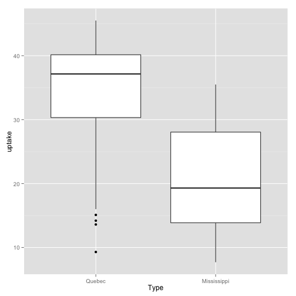

## Trying to ``git'' a clue


Download and install the lastest version of [Git.](http://git-scm.com/downloads)


If you have never used git before, you need to do some setup first.  Run the following commands so that git knows your name and email.  The third line adds pretty command line colors. 


```bash
git config --global user.name "Your Name"
git config --global user.email "your_email@whatever.com"
git config --global color.ui true
```


Check the current status of your repository:

```bash
git status
```

```
# On branch master
# Changes not staged for commit:
#   (use "git add <file>..." to update what will be committed)
#   (use "git checkout -- <file>..." to discard changes in working directory)
#
#	modified:   GIT_LAB1.Rmd
#	modified:   GIT_LAB1.html
#	modified:   GIT_LAB1.md
#	modified:   GIT_LAB1.pdf
#
no changes added to commit (use "git add" and/or "git commit -a")
```


Next all files are added to the staging area and a snapshot is taken of the commit with the message "staging all files".

```bash
git add .
git commit  -m "staging all files"
```

```
[master dd98df0] staging all files
 4 files changed, 250 insertions(+), 296 deletions(-)
 rewrite Alan/summaries/GIT_LAB1.html (85%)
```


Check the status after the last commit.

```bash
git status
```

```
# On branch master
# Your branch is ahead of 'origin/master' by 1 commit.
#
nothing to commit (working directory clean)
```

Push changes to the remote repository. 

```bash
git push
```

See if there is anything left to do.

```bash
git status
```

```
# On branch master
nothing to commit (working directory clean)
```

Show the last three commits with

```bash
git log  -3
```

```
commit dd98df02edaf91e15555f47b6c3c4b65a6285c80
Author: Alan Arnholt <arnholtat@appstate.edu>
Date:   Thu Jan 9 13:59:37 2014 -0500

    staging all files

commit fd942da70649c0523132338065879f525d738c9b
Author: Alan Arnholt <arnholtat@appstate.edu>
Date:   Thu Jan 9 13:58:20 2014 -0500

    staging all files

commit e240e45ba66f2d0d0d700e055bf24d7910764664
Author: Alan Arnholt <arnholtat@appstate.edu>
Date:   Thu Jan 9 13:57:51 2014 -0500

    staging all files
```


Now, just to show how cool this is, we will mix in a little `R`.


```r
library(ggplot2)
ggplot(data = CO2, aes(x = Type, y = uptake)) + geom_boxplot()
```



