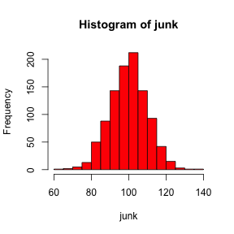
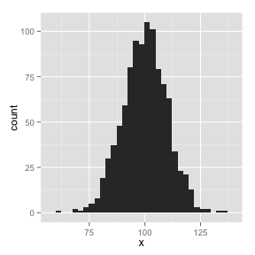

# Doing it with OSX

## Having fun --- or Not

OK....does **bash** work with OSX?

First, check if the following works at the **R** prompt.


```r
Sys.which("bash")
```

```
       bash 
"/bin/bash" 
```


Cool!  It looks like I am good to go.

Now we will print the working directory from **bash**.


```bash
pwd
```

```
/Users/alan/git_repositories/SEMINAR/Alan/summaries/shell
```


To see if **sh** will work, test to see if it is found on your system.  
I have **xcode** installed on my system.  You may want to install [xcode](https://developer.apple.com/xcode/) if you have not already.


```r
Sys.which("sh")
```

```
       sh 
"/bin/sh" 
```


Hot dog!  This is working.  Issue some commands to see what is in the working directory.


```sh
ls -a
```

```
.
..
MacCheck.Rmd
MacCheck.html
MacCheck.md
WindowsCheck.Rmd
WindowsCheck.html
WindowsCheck.md
figure
```


Maybe a little more information. Note: `-al` lists details for hidden and 
unhiddn files and folders.


```sh
ls -al
```

```
total 144
drwxr-xr-x  9 alan  staff    306 Feb  3 16:47 .
drwxr-xr-x  8 alan  staff    272 Feb  3 14:15 ..
-rw-r--r--  1 alan  staff   1289 Feb  3 16:48 MacCheck.Rmd
-rw-r--r--  1 alan  staff  39794 Feb  3 16:47 MacCheck.html
-rw-r--r--  1 alan  staff   2496 Feb  3 16:47 MacCheck.md
-rw-r--r--  1 alan  staff   1085 Feb  3 14:15 WindowsCheck.Rmd
-rw-r--r--  1 alan  staff  15189 Feb  3 14:15 WindowsCheck.html
-rw-r--r--  1 alan  staff   1646 Feb  3 14:15 WindowsCheck.md
drwxr-xr-x  5 alan  staff    170 Feb  3 16:47 figure
```

`touch` creates an empty file


```sh
touch NewFile
ls
```

```
MacCheck.Rmd
MacCheck.html
MacCheck.md
NewFile
WindowsCheck.Rmd
WindowsCheck.html
WindowsCheck.md
figure
```


```sh
rm NewFile
ls
```

```
MacCheck.Rmd
MacCheck.html
MacCheck.md
WindowsCheck.Rmd
WindowsCheck.html
WindowsCheck.md
figure
```


What time is it?


```bash
date
```

```
Mon Feb  3 16:48:13 EST 2014
```


```r
junk <- rnorm(1000, 100, 10)
hist(junk, col = "red")
library(ggplot2)
```



```r
ggplot(data.frame(x = junk), aes(x = x)) + geom_histogram()
```



