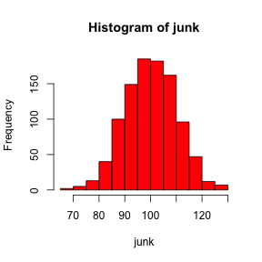
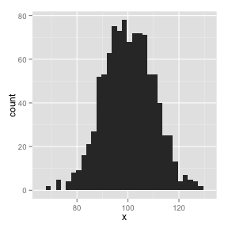
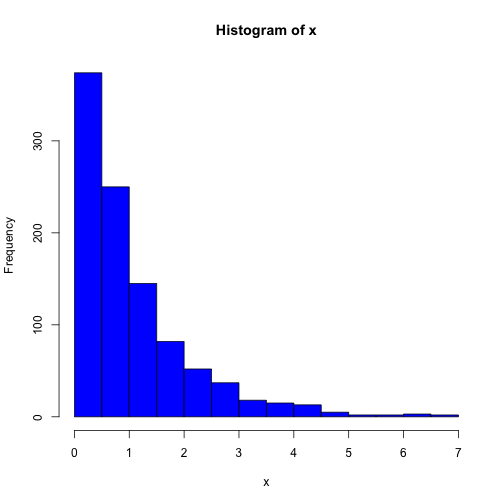

# Doing it with OSX

## Having fun --- or Not

OK....does **bash** work with OSX?

First, check if the following works at the **R** prompt.


```r
Sys.which("bash")
```

```
       bash 
"/bin/bash" 
```


Cool!  It looks like I am good to go.

Now we will print the working directory from **bash**.


```bash
pwd
```

```
/Users/ekreiling1/git_repositories/SEMINAR/Erin/Shell
```


To see if **sh** will work, test to see if it is found on your system.  
I have **xcode** installed on my system.  You may want to install [xcode](https://developer.apple.com/xcode/) if you have not already.


```bash
ls
cd
```

```
MacCheck.Rmd
MacCheck.html
MacCheck.md
figure
```


Hot dog!  This is working.  Issue some commands to see what is in the working directory.


```sh
ls -a
```

```
.
..
MacCheck.Rmd
MacCheck.html
MacCheck.md
figure
```


Maybe a little more information. Note: `-al` lists details for hidden and 
unhiddn files and folders.


```sh
ls -al
```

```
total 136
drwxr-xr-x  6 ekreiling1  staff    204 Feb  3 16:43 .
drwxr-xr-x  5 ekreiling1  staff    170 Feb  3 15:58 ..
-rw-r--r--  1 ekreiling1  staff   1388 Feb  3 16:44 MacCheck.Rmd
-rw-r--r--  1 ekreiling1  staff  60814 Feb  3 16:43 MacCheck.html
-rw-r--r--  1 ekreiling1  staff   2326 Feb  3 16:43 MacCheck.md
drwxr-xr-x  5 ekreiling1  staff    170 Feb  3 16:43 figure
```

`touch` creates an empty file


```sh
touch NewFile
ls
```

```
MacCheck.Rmd
MacCheck.html
MacCheck.md
NewFile
figure
```


```sh
rm NewFile
ls
```

```
MacCheck.Rmd
MacCheck.html
MacCheck.md
figure
```


What time is it?


```bash
date
```

```
Mon Feb  3 16:44:15 EST 2014
```


```r
#### Folded chunk ####
junk <- rnorm(1000, 100, 10)
hist(junk, col = "red")
library(ggplot2)
```



```r
ggplot(data.frame(x = junk), aes(x = x)) + geom_histogram()
```

```
## stat_bin: binwidth defaulted to range/30. Use 'binwidth = x' to adjust this.
```




```r
x <- rexp(1000)
hist(x, col = "blue")
```


