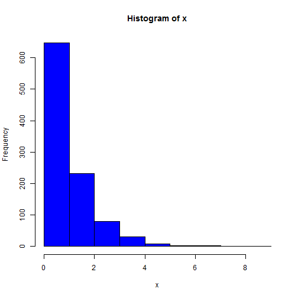
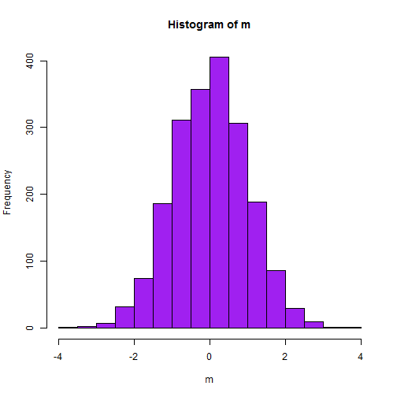

# Doing it with Windows

## Having fun --- or Not

OK....does **bash** work with windows?

First, check if the following works at the **R** prompt.


```r
Sys.which("bash")
```

```
                                              bash 
"C:\\Users\\ODONN_~1\\Desktop\\Git\\bin\\bash.exe" 
```


Cool!  It looks like I am good to go.

Now we will print the working directory from **bash**.


```bash
pwd
```

```
/c/Users/odonn_000/Documents/Spring_2014/STT_Senior_Seminar/git_repositories/SEMINAR/Maureen/Shell
```


To see if **sh** will work, test to see if it is found on your system.  
I have **Rtools** installed on my system.  You may want to install [Rtools](http://cran.r-project.org/bin/windows/Rtools/) if you have not already.


```r
Sys.which("sh")
```

```
                                              sh 
"C:\\Users\\ODONN_~1\\Desktop\\Git\\bin\\sh.exe" 
```


Hot dog!  This is working.  Issue some commands to see what is in the working directory.


```sh
ls -a
```

```
.
..
WindowsCheck.Rmd
WindowsCheck.html
WindowsCheck.md
figure
```


Maybe a little more information. Note: `-al` lists details for hidden and 
unhiddn files and folders.


```sh
ls -al
```

```
total 19
drwxr-xr-x    6 odonn_00 Administ     4096 Feb  3 16:48 .
drwxr-xr-x    5 odonn_00 Administ     4096 Feb  3 15:58 ..
-rw-r--r--    1 odonn_00 Administ     1376 Feb  3 16:48 WindowsCheck.Rmd
-rw-r--r--    1 odonn_00 Administ    24849 Feb  3 16:48 WindowsCheck.html
-rw-r--r--    1 odonn_00 Administ     2397 Feb  3 16:48 WindowsCheck.md
drwxr-xr-x    5 odonn_00 Administ        0 Feb  3 16:46 figure
```

`touch` creates an empty file


```sh
touch NewFile
ls
```

```
NewFile
WindowsCheck.Rmd
WindowsCheck.html
WindowsCheck.md
figure
```


```sh
rm NewFile
ls
```

```
WindowsCheck.Rmd
WindowsCheck.html
WindowsCheck.md
figure
```


What time is it?


```bash
date
```

```
Mon Feb  3 16:48:48 EST 2014
```


```r
x <- rexp(1000)
hist(x, col = "blue")
```

 


```r
m <- rnorm(2000)
hist(m, col = "purple")
```

 


```r
n <- rbinom(2000)
```

```
## Error: argument "size" is missing, with no default
```

```r
hist(n, col = "salmon")
```

```
## Error: object 'n' not found
```


